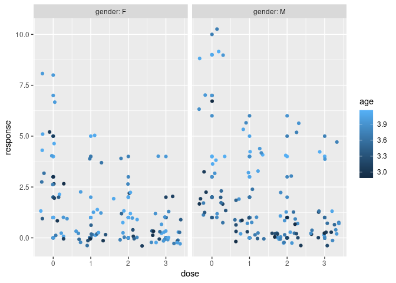
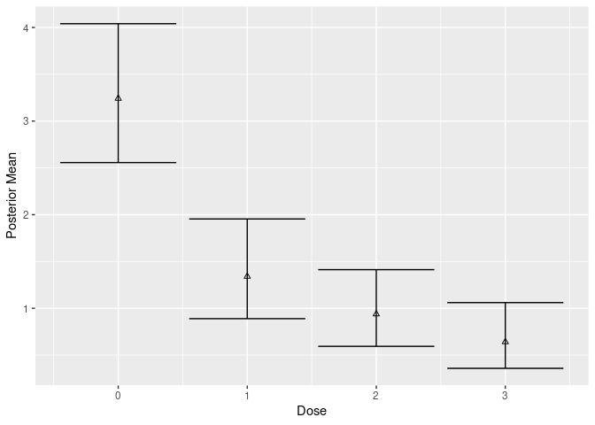
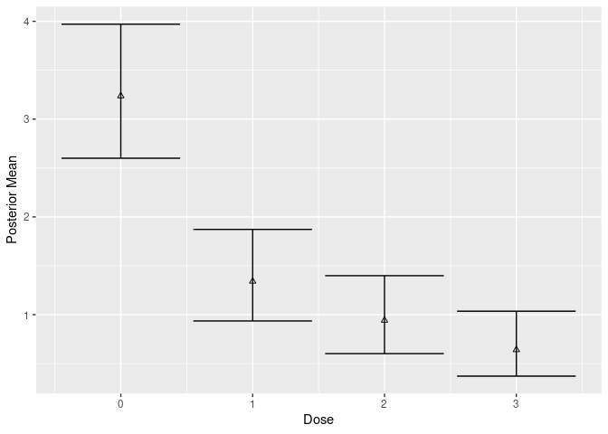
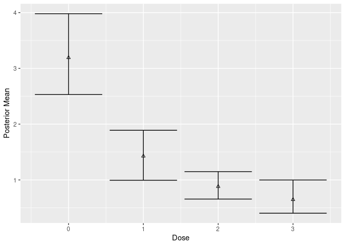
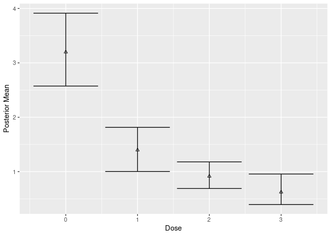
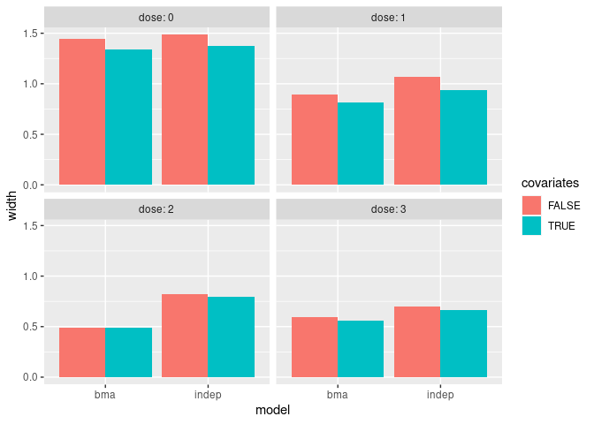

<!-- README.md is generated from README.Rmd. Please edit that file -->

# beaver

<!-- badges: start -->
[](https://github.com/rich-payne/beaver/actions/workflows/check-standard.yaml)
[](https://github.com/rich-payne/beaver/actions/workflows/test-coverage.yaml)
[](https://github.com/rich-payne/beaver/actions/workflows/lint.yaml)
<!-- badges: end -->

The goal of beaver is to fit Bayesian model averaging of
negative-binomial dose-response models.

We begin with an example where we simulate negative binomial data where
age and gender are prognostic factors. In this example, males have
higher counts than females and older individual have higher counts than
younger people.

``` r
library(dplyr)
#> 
#> Attaching package: 'dplyr'
#> The following objects are masked from 'package:stats':
#> 
#>     filter, lag
#> The following objects are masked from 'package:base':
#> 
#>     intersect, setdiff, setequal, union
library(ggplot2)
library(beaver)
set.seed(222)
n <- 200
x <- data.frame(
  age = log(runif(n, 18, 65)),
  gender = factor(sample(c("F", "M"), n, replace = TRUE))
) %>%
  model.matrix(~age + gender, data = .)
df <- data_negbin_emax(
  n_per_arm = 50,
  doses = 0:3,
  b1 = c(-2, .75, .5),
  # b1 = c(-1, 0, 0),
  b2 = -2,
  b3 = 1.5,
  ps = .5,
  x = x
) %>%
  mutate(
    gender = case_when(
      genderM == 1 ~ "M",
      TRUE ~ "F"
    ),
    gender = factor(gender)
  ) %>%
  dplyr::select(subject, dose, age, gender, response)

data_sumry <- df %>%
  group_by(dose) %>%
  summarize(
    response = mean(response),
    age = mean(age),
    male = mean(gender == "M")
  )

ggplot(df, aes(dose, response, color = age)) +
  geom_point() +
  geom_jitter() +
  facet_grid(~ gender, labeller = label_both)
```



We now fit fit a Bayesian model where each dose is treated independently
(no dose response) without covariates:

``` r
mcmc_indep <- beaver_mcmc(
  indep = model_negbin_indep(
    mu_b1 = 0,
    sigma_b1 = 10,
    mu_b2 = 0,
    sigma_b2 = 10,
    w_prior = 1
  ),
  formula = ~ 1,
  data = df,
  n_adapt = 1e4,
  n_burn = 1e4,
  n_iter = 1e4,
  n_chains = 4,
  quiet = FALSE
)
#> Warning in rjags::jags.model(file = get_jags_model(model), data = jags_data, :
#> Unused variable "dose" in data
#> Compiling model graph
#>    Resolving undeclared variables
#>    Allocating nodes
#> Graph information:
#>    Observed stochastic nodes: 200
#>    Unobserved stochastic nodes: 8
#>    Total graph size: 641
#> 
#> Initializing model
# convergence
coda::gelman.diag(mcmc_indep$models$indep$mcmc, multivariate = FALSE)
#> Potential scale reduction factors:
#> 
#>             Point est. Upper C.I.
#> (Intercept)          1          1
#> b2[1]              NaN        NaN
#> b2[2]                1          1
#> b2[3]                1          1
#> b2[4]                1          1
#> p[1]                 1          1
#> p[2]                 1          1
#> p[3]                 1          1
#> p[4]                 1          1
# posterior mean at each dose
post_ind <- posterior(mcmc_indep, contrast = matrix(1, 1, 1))
post_ind$stats
#> # A tibble: 4 × 6
#>    dose .contrast_index `(Intercept)` value `2.50%` `97.50%`
#>   <int>           <int>         <dbl> <dbl>   <dbl>    <dbl>
#> 1     0               1             1 3.24    2.56      4.04
#> 2     1               1             1 1.34    0.889     1.95
#> 3     2               1             1 0.938   0.593     1.41
#> 4     3               1             1 0.640   0.358     1.06
# summary of data
data_sumry
#> # A tibble: 4 × 4
#>    dose response   age  male
#>   <int>    <dbl> <dbl> <dbl>
#> 1     0     3.22  3.66  0.52
#> 2     1     1.32  3.69  0.54
#> 3     2     0.92  3.69  0.62
#> 4     3     0.62  3.66  0.44

plot(mcmc_indep, contrast = matrix(1, 1, 1))
```



We now fit fit a Bayesian model where each dose is treated independently
(no dose response), but now include covariates:

``` r
mcmc_cov_indep <- beaver_mcmc(
  indep = model_negbin_indep(
    mu_b1 = 0,
    sigma_b1 = 10,
    mu_b2 = 0,
    sigma_b2 = 10,
    w_prior = 1
  ),
  formula = ~ age + gender,
  data = df,
  n_adapt = 1e4,
  n_burn = 1e4,
  n_iter = 1e4,
  n_chains = 4,
  quiet = FALSE
)
#> Warning in rjags::jags.model(file = get_jags_model(model), data = jags_data, :
#> Unused variable "dose" in data
#> Compiling model graph
#>    Resolving undeclared variables
#>    Allocating nodes
#> Graph information:
#>    Observed stochastic nodes: 200
#>    Unobserved stochastic nodes: 10
#>    Total graph size: 2227
#> 
#> Initializing model

coda::gelman.diag(mcmc_cov_indep$models$indep$mcmc, multivariate = FALSE)
#> Potential scale reduction factors:
#> 
#>             Point est. Upper C.I.
#> (Intercept)       1.01       1.01
#> age               1.01       1.01
#> genderM           1.00       1.00
#> b2[1]              NaN        NaN
#> b2[2]             1.00       1.00
#> b2[3]             1.00       1.00
#> b2[4]             1.00       1.00
#> p[1]              1.00       1.00
#> p[2]              1.00       1.00
#> p[3]              1.00       1.00
#> p[4]              1.00       1.00
# Bayesian g-computation estimate
post_cov_ind <- posterior_g_comp(mcmc_cov_indep, new_data = df)
# compare widths of covariate adjusted and non-covariate adjusted
mutate(post_cov_ind$stats, width = `97.50%` - `2.50%`)
#> # A tibble: 4 × 5
#>    dose value `2.50%` `97.50%` width
#>   <int> <dbl>   <dbl>    <dbl> <dbl>
#> 1     0 3.24    2.60      3.97 1.37 
#> 2     1 1.34    0.936     1.87 0.937
#> 3     2 0.942   0.602     1.40 0.797
#> 4     3 0.641   0.372     1.04 0.664
mutate(post_ind$stats, width = `97.50%` - `2.50%`)
#> # A tibble: 4 × 7
#>    dose .contrast_index `(Intercept)` value `2.50%` `97.50%` width
#>   <int>           <int>         <dbl> <dbl>   <dbl>    <dbl> <dbl>
#> 1     0               1             1 3.24    2.56      4.04 1.48 
#> 2     1               1             1 1.34    0.889     1.95 1.07 
#> 3     2               1             1 0.938   0.593     1.41 0.819
#> 4     3               1             1 0.640   0.358     1.06 0.702
# data_sumry
plot(mcmc_cov_indep, new_data = df, type = "g-comp")
```



# Bayesian Model Averaging

We now fit Bayesian dose-respone models with and without covariate
adjustment.

``` r
mcmc <- beaver_mcmc(
  emax = model_negbin_emax(
    mu_b1 = 0,
    sigma_b1 = 10,
    mu_b2 = 0,
    sigma_b2 = 10,
    mu_b3 = 1.5,
    sigma_b3 = 3,
    w_prior = 1 / 7
  ),
  sigmoid_emax = model_negbin_sigmoid_emax(
    mu_b1 = 0,
    sigma_b1 = 10,
    mu_b2 = 0,
    sigma_b2 = 10,
    mu_b3 = 1.5,
    sigma_b3 = 3,
    mu_b4 = 1,
    sigma_b4 = 10,
    w_prior = 1 / 7
  ),
  linear = model_negbin_linear(
    mu_b1 = 0,
    sigma_b1 = 10,
    mu_b2 = 0,
    sigma_b2 = 10,
    w_prior = 1 / 7
  ),
  loglinear = model_negbin_loglinear(
    mu_b1 = 0,
    sigma_b1 = 10,
    mu_b2 = 0,
    sigma_b2 = 10,
    w_prior = 1 / 7
  ),
  quad = model_negbin_quad(
    mu_b1 = 0,
    sigma_b1 = 10,
    mu_b2 = 0,
    sigma_b2 = 10,
    mu_b3 = 1.5,
    sigma_b3 = 3,
    w_prior = 1 / 7
  ),
  logquad = model_negbin_logquad(
    mu_b1 = 0,
    sigma_b1 = 10,
    mu_b2 = 0,
    sigma_b2 = 10,
    mu_b3 = 1.5,
    sigma_b3 = 3,
    w_prior = 1 / 7
  ),
  exp = model_negbin_exp(
    mu_b1 = 0,
    sigma_b1 = 10,
    mu_b2 = 0,
    sigma_b2 = 10,
    mu_b3 = 0,
    sigma_b3 = 3,
    w_prior = 1 / 7
  ),
  formula = ~ 1,
  data = df,
  n_adapt = 1e4,
  n_burn = 1e4,
  n_iter = 1e4,
  n_chains = 4,
  quiet = FALSE
)
#> Compiling model graph
#>    Resolving undeclared variables
#>    Allocating nodes
#> Graph information:
#>    Observed stochastic nodes: 200
#>    Unobserved stochastic nodes: 7
#>    Total graph size: 660
#> 
#> Initializing model
#> 
#> Compiling model graph
#>    Resolving undeclared variables
#>    Allocating nodes
#> Graph information:
#>    Observed stochastic nodes: 200
#>    Unobserved stochastic nodes: 8
#>    Total graph size: 668
#> 
#> Initializing model
#> 
#> Compiling model graph
#>    Resolving undeclared variables
#>    Allocating nodes
#> Graph information:
#>    Observed stochastic nodes: 200
#>    Unobserved stochastic nodes: 6
#>    Total graph size: 647
#> 
#> Initializing model
#> 
#> Compiling model graph
#>    Resolving undeclared variables
#>    Allocating nodes
#> Graph information:
#>    Observed stochastic nodes: 200
#>    Unobserved stochastic nodes: 6
#>    Total graph size: 655
#> 
#> Initializing model
#> 
#> Compiling model graph
#>    Resolving undeclared variables
#>    Allocating nodes
#> Graph information:
#>    Observed stochastic nodes: 200
#>    Unobserved stochastic nodes: 7
#>    Total graph size: 659
#> 
#> Initializing model
#> 
#> Compiling model graph
#>    Resolving undeclared variables
#>    Allocating nodes
#> Graph information:
#>    Observed stochastic nodes: 200
#>    Unobserved stochastic nodes: 7
#>    Total graph size: 668
#> 
#> Initializing model
#> 
#> Compiling model graph
#>    Resolving undeclared variables
#>    Allocating nodes
#> Graph information:
#>    Observed stochastic nodes: 200
#>    Unobserved stochastic nodes: 7
#>    Total graph size: 665
#> 
#> Initializing model

mcmc_cov <- beaver_mcmc(
  emax = model_negbin_emax(
    mu_b1 = 0,
    sigma_b1 = 10,
    mu_b2 = 0,
    sigma_b2 = 10,
    mu_b3 = 1.5,
    sigma_b3 = 3,
    w_prior = 1 / 7
  ),
  sigmoid_emax = model_negbin_sigmoid_emax(
    mu_b1 = 0,
    sigma_b1 = 10,
    mu_b2 = 0,
    sigma_b2 = 10,
    mu_b3 = 1.5,
    sigma_b3 = 3,
    mu_b4 = 1,
    sigma_b4 = 10,
    w_prior = 1 / 7
  ),
  linear = model_negbin_linear(
    mu_b1 = 0,
    sigma_b1 = 10,
    mu_b2 = 0,
    sigma_b2 = 10,
    w_prior = 1 / 7
  ),
  loglinear = model_negbin_loglinear(
    mu_b1 = 0,
    sigma_b1 = 10,
    mu_b2 = 0,
    sigma_b2 = 10,
    w_prior = 1 / 7
  ),
  quad = model_negbin_quad(
    mu_b1 = 0,
    sigma_b1 = 10,
    mu_b2 = 0,
    sigma_b2 = 10,
    mu_b3 = 1.5,
    sigma_b3 = 3,
    w_prior = 1 / 7
  ),
  logquad = model_negbin_logquad(
    mu_b1 = 0,
    sigma_b1 = 10,
    mu_b2 = 0,
    sigma_b2 = 10,
    mu_b3 = 1.5,
    sigma_b3 = 3,
    w_prior = 1 / 7
  ),
  exp = model_negbin_exp(
    mu_b1 = 0,
    sigma_b1 = 10,
    mu_b2 = 0,
    sigma_b2 = 10,
    mu_b3 = 0,
    sigma_b3 = 3,
    w_prior = 1 / 7
  ),
  formula = ~ age + gender,
  data = df,
  n_adapt = 1e4,
  n_burn = 1e4,
  n_iter = 1e4,
  n_chains = 4,
  quiet = FALSE
)
#> Compiling model graph
#>    Resolving undeclared variables
#>    Allocating nodes
#> Graph information:
#>    Observed stochastic nodes: 200
#>    Unobserved stochastic nodes: 9
#>    Total graph size: 2246
#> 
#> Initializing model
#> 
#> Compiling model graph
#>    Resolving undeclared variables
#>    Allocating nodes
#> Graph information:
#>    Observed stochastic nodes: 200
#>    Unobserved stochastic nodes: 10
#>    Total graph size: 2254
#> 
#> Initializing model
#> 
#> Compiling model graph
#>    Resolving undeclared variables
#>    Allocating nodes
#> Graph information:
#>    Observed stochastic nodes: 200
#>    Unobserved stochastic nodes: 8
#>    Total graph size: 2233
#> 
#> Initializing model
#> 
#> Compiling model graph
#>    Resolving undeclared variables
#>    Allocating nodes
#> Graph information:
#>    Observed stochastic nodes: 200
#>    Unobserved stochastic nodes: 8
#>    Total graph size: 2241
#> 
#> Initializing model
#> 
#> Compiling model graph
#>    Resolving undeclared variables
#>    Allocating nodes
#> Graph information:
#>    Observed stochastic nodes: 200
#>    Unobserved stochastic nodes: 9
#>    Total graph size: 2245
#> 
#> Initializing model
#> 
#> Compiling model graph
#>    Resolving undeclared variables
#>    Allocating nodes
#> Graph information:
#>    Observed stochastic nodes: 200
#>    Unobserved stochastic nodes: 9
#>    Total graph size: 2254
#> 
#> Initializing model
#> 
#> Compiling model graph
#>    Resolving undeclared variables
#>    Allocating nodes
#> Graph information:
#>    Observed stochastic nodes: 200
#>    Unobserved stochastic nodes: 9
#>    Total graph size: 2251
#> 
#> Initializing model

# diagnostics for each model
coda::gelman.diag(mcmc$models$exp$mcmc)
#> Potential scale reduction factors:
#> 
#>             Point est. Upper C.I.
#> (Intercept)       1.00       1.00
#> b2                1.04       1.06
#> b3                1.04       1.05
#> p[1]              1.00       1.00
#> p[2]              1.00       1.00
#> p[3]              1.00       1.00
#> p[4]              1.00       1.00
#> 
#> Multivariate psrf
#> 
#> 1.02
coda::gelman.diag(mcmc$models$emax$mcmc)
#> Potential scale reduction factors:
#> 
#>             Point est. Upper C.I.
#> (Intercept)          1       1.00
#> b2                   1       1.01
#> b3                   1       1.01
#> p[1]                 1       1.00
#> p[2]                 1       1.00
#> p[3]                 1       1.00
#> p[4]                 1       1.00
#> 
#> Multivariate psrf
#> 
#> 1
coda::gelman.diag(mcmc$models$sigmoid_emax$mcmc)
#> Potential scale reduction factors:
#> 
#>             Point est. Upper C.I.
#> (Intercept)       1.00       1.00
#> b2                1.01       1.02
#> b3                1.01       1.02
#> b4                1.07       1.13
#> p[1]              1.00       1.00
#> p[2]              1.00       1.00
#> p[3]              1.00       1.00
#> p[4]              1.00       1.00
#> 
#> Multivariate psrf
#> 
#> 1.02
coda::gelman.diag(mcmc$models$linear$mcmc)
#> Potential scale reduction factors:
#> 
#>             Point est. Upper C.I.
#> (Intercept)          1          1
#> b2                   1          1
#> p[1]                 1          1
#> p[2]                 1          1
#> p[3]                 1          1
#> p[4]                 1          1
#> 
#> Multivariate psrf
#> 
#> 1
coda::gelman.diag(mcmc$models$quad$mcmc)
#> Potential scale reduction factors:
#> 
#>             Point est. Upper C.I.
#> (Intercept)          1       1.00
#> b2                   1       1.01
#> b3                   1       1.01
#> p[1]                 1       1.00
#> p[2]                 1       1.00
#> p[3]                 1       1.00
#> p[4]                 1       1.00
#> 
#> Multivariate psrf
#> 
#> 1
coda::gelman.diag(mcmc$models$logquad$mcmc)
#> Potential scale reduction factors:
#> 
#>             Point est. Upper C.I.
#> (Intercept)       1.00       1.00
#> b2                1.01       1.02
#> b3                1.01       1.02
#> p[1]              1.00       1.00
#> p[2]              1.00       1.00
#> p[3]              1.00       1.00
#> p[4]              1.00       1.00
#> 
#> Multivariate psrf
#> 
#> 1.01
coda::gelman.diag(mcmc$models$loglinear$mcmc)
#> Potential scale reduction factors:
#> 
#>             Point est. Upper C.I.
#> (Intercept)          1          1
#> b2                   1          1
#> p[1]                 1          1
#> p[2]                 1          1
#> p[3]                 1          1
#> p[4]                 1          1
#> 
#> Multivariate psrf
#> 
#> 1
# posterior weight
mcmc$w_post
#>         emax sigmoid_emax       linear    loglinear         quad      logquad 
#>   0.14906065   0.08267935   0.10350408   0.24816205   0.13162263   0.14381195 
#>          exp 
#>   0.14115929
# posterior estimate
post <- posterior(mcmc, contrast = matrix(1, 1, 1), doses = 0:3)
post$stats
#> # A tibble: 4 × 6
#>    dose .contrast_index `(Intercept)` value `2.50%` `97.50%`
#>   <int>           <int>         <dbl> <dbl>   <dbl>    <dbl>
#> 1     0               1             1 3.19    2.53     3.98 
#> 2     1               1             1 1.43    0.995    1.89 
#> 3     2               1             1 0.882   0.657    1.15 
#> 4     3               1             1 0.647   0.403    0.999

# covariate adusted
coda::gelman.diag(mcmc_cov$models$exp$mcmc)
#> Potential scale reduction factors:
#> 
#>             Point est. Upper C.I.
#> (Intercept)       1.03       1.07
#> age               1.02       1.06
#> genderM           1.00       1.01
#> b2                1.09       1.19
#> b3                1.02       1.04
#> p[1]              1.00       1.00
#> p[2]              1.00       1.01
#> p[3]              1.00       1.00
#> p[4]              1.00       1.00
#> 
#> Multivariate psrf
#> 
#> 1.03
coda::gelman.diag(mcmc_cov$models$emax$mcmc)
#> Potential scale reduction factors:
#> 
#>             Point est. Upper C.I.
#> (Intercept)       1.01       1.03
#> age               1.01       1.03
#> genderM           1.00       1.00
#> b2                1.00       1.01
#> b3                1.00       1.01
#> p[1]              1.00       1.00
#> p[2]              1.00       1.00
#> p[3]              1.00       1.00
#> p[4]              1.00       1.00
#> 
#> Multivariate psrf
#> 
#> 1.01
coda::gelman.diag(mcmc_cov$models$sigmoid_emax$mcmc)
#> Potential scale reduction factors:
#> 
#>             Point est. Upper C.I.
#> (Intercept)       1.01       1.02
#> age               1.01       1.02
#> genderM           1.00       1.00
#> b2                1.01       1.02
#> b3                1.00       1.01
#> b4                1.02       1.04
#> p[1]              1.00       1.00
#> p[2]              1.00       1.00
#> p[3]              1.00       1.00
#> p[4]              1.00       1.00
#> 
#> Multivariate psrf
#> 
#> 1.01
coda::gelman.diag(mcmc_cov$models$linear$mcmc)
#> Potential scale reduction factors:
#> 
#>             Point est. Upper C.I.
#> (Intercept)       1.04        1.1
#> age               1.04        1.1
#> genderM           1.00        1.0
#> b2                1.00        1.0
#> p[1]              1.00        1.0
#> p[2]              1.00        1.0
#> p[3]              1.00        1.0
#> p[4]              1.00        1.0
#> 
#> Multivariate psrf
#> 
#> 1.02
coda::gelman.diag(mcmc_cov$models$quad$mcmc)
#> Potential scale reduction factors:
#> 
#>             Point est. Upper C.I.
#> (Intercept)       1.02       1.06
#> age               1.02       1.06
#> genderM           1.00       1.00
#> b2                1.00       1.01
#> b3                1.00       1.01
#> p[1]              1.00       1.00
#> p[2]              1.00       1.00
#> p[3]              1.00       1.00
#> p[4]              1.00       1.00
#> 
#> Multivariate psrf
#> 
#> 1.02
coda::gelman.diag(mcmc_cov$models$loglinear$mcmc)
#> Potential scale reduction factors:
#> 
#>             Point est. Upper C.I.
#> (Intercept)       1.11       1.28
#> age               1.10       1.28
#> genderM           1.01       1.02
#> b2                1.00       1.00
#> p[1]              1.00       1.00
#> p[2]              1.00       1.01
#> p[3]              1.00       1.00
#> p[4]              1.00       1.00
#> 
#> Multivariate psrf
#> 
#> 1.08
coda::gelman.diag(mcmc_cov$models$logquad$mcmc)
#> Potential scale reduction factors:
#> 
#>             Point est. Upper C.I.
#> (Intercept)       1.01       1.03
#> age               1.02       1.04
#> genderM           1.00       1.00
#> b2                1.01       1.02
#> b3                1.01       1.02
#> p[1]              1.00       1.00
#> p[2]              1.00       1.00
#> p[3]              1.00       1.00
#> p[4]              1.00       1.00
#> 
#> Multivariate psrf
#> 
#> 1.01

post_cov_g <- posterior_g_comp(mcmc_cov, new_data = df)
post_cov_g$stats
#> # A tibble: 4 × 4
#>    dose value `2.50%` `97.50%`
#>   <int> <dbl>   <dbl>    <dbl>
#> 1     0 3.20    2.57     3.91 
#> 2     1 1.40    1.00     1.81 
#> 3     2 0.915   0.690    1.18 
#> 4     3 0.624   0.395    0.957

# no covariate adjustment
plot(mcmc, contrast = matrix(1, 1, 1))
```



``` r
# with covariate adjustment
plot(mcmc_cov, new_data = df, type = "g-comp")
```



The following plot shows the widths of the credible intervals comparing
the covariate-adjusted and unadjusted analyses.

``` r
# compare widths
w_indep <- mutate(
  post_ind$stats,
  width = `97.50%` - `2.50%`,
  model = "indep",
  covariates = FALSE
) %>%
  select(dose, model, covariates, mean = value, `2.50%`, `97.50%`, width)

w_indep_cov <- mutate(
  post_cov_ind$stats,
  width = `97.50%` - `2.50%`,
  model = "indep",
  covariates = TRUE
) %>%
  select(dose, model, covariates, mean = value, `2.50%`, `97.50%`, width)

w_bma <- mutate(
  post$stats,
  width = `97.50%` - `2.50%`,
  model = "bma",
  covariates = FALSE
) %>%
  select(dose, model, covariates, mean = value, `2.50%`, `97.50%`, width)

w_bma_cov <- mutate(
  post_cov_g$stats,
  width = `97.50%` - `2.50%`,
  model = "bma",
  covariates = TRUE
) %>%
  select(dose, model, covariates, mean = value, `2.50%`, `97.50%`, width)

widths <- bind_rows(w_indep, w_indep_cov, w_bma, w_bma_cov)

ggplot(widths, aes(model, width, fill = covariates)) +
  geom_bar(stat = "identity", position = "dodge") +
  facet_wrap(~dose, labeller = label_both)
```



# Installation

``` r
install.packages("beaver")
```
